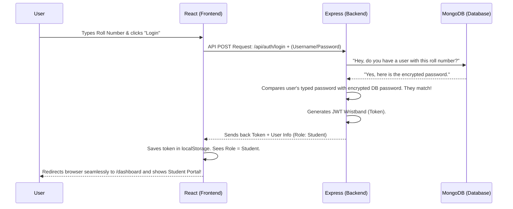

# HackTrack: Under the Hood

Welcome to the internal workings of **HackTrack**! This document explains how this entire system is built and connected. We use a **MERN** stack (MongoDB, Express, React, Node.js). Think of this application like a restaurant:

*   **React (Frontend)** is the **Menu and the Dining Room**. It's what the customer (user) sees, clicks, and interacts with.
*   **Node.js & Express (Backend)** is the **Waiter and Kitchen Manager**. It takes the orders from the dining room, checks if they are valid, and talks to the pantry.
*   **MongoDB (Database)** is the **Pantry/Storage**. It permanently holds all the raw ingredients (data) safely.

Let's break down how these parts talk to each other!

---

## 1. Backend Connection (MongoDB - The Pantry)

MongoDB is a "NoSQL" database, meaning it stores data in flexible "documents" that look exactly like JavaScript objects (JSON) rather than rigid Excel tables.

**How the application connects to MongoDB:**
Our Node.js app uses a library called `mongoose` to talk to MongoDB. 
When the server starts, it reads a **Connection String** hidden in our `.env` file (so hackers can't see the password). 

**What the connection string does:**
It acts like a secret map coordinates + key. It tells our server exactly which server farm on the internet (MongoDB Atlas cloud) holds our data, and provides the admin username and password to let us in.

**Role of Schemas and Models:**
If MongoDB is a warehouse, a **Schema** is the blueprint for a box. For example, our `User.js` schema tells the database: *"Every user MUST have a username, a hashed password, and a defined role (student, coordinator, etc.)"*. A **Model** is the actual machine that builds those boxes. When we want to save a new hackathon, we ask the `Hackathon` model to build it and put it in the database.

---

## 2. Node.js Implementation (Server Side - The Waiter)

Our server is built using **Node.js** and **Express**. Express acts as our traffic controller.

**How routes, controllers, and middleware work:**
*   **Routes:** These are like different doors to the kitchen. For example, `GET /api/hackathons` is the door you knock on if you want a list of hackathons.
*   **Controllers:** The logic behind the door. When someone knocks on `/api/requests`, the controller says, *"Okay, go to the Database, find all requests, and hand them to the user."*
*   **Middleware:** Think of this as the **Security Bouncer**. Before the user is allowed into a route, a middleware function runs. It checks: *"Hey, do you have your ID badge? Let me see it before you proceed."*

**How Authentication (JWT) is handled:**
When a user logs in with valid credentials, the backend generates a **JSON Web Token (JWT)**. This is exactly like an amusement park wristband. 
1. The user logs in.
2. The server says, "Password is correct! Here is your wristband (JWT token), it's valid for 5 hours."
3. The server sends the token back to the frontend.
4. For every future request (like applying for a hackathon), the user shows that wristband instead of typing their password again.

---

## 3. React Implementation (Frontend - The Dining Room)

Our frontend is built with React, which creates reusable Lego blocks of code called **Components** (like buttons, navigation bars, and modals).

**How state and routing are managed:**
*   **Routing:** Handled by `react-router-dom`. It watches the web address. If the URL is `/login`, it renders the `Login.jsx` component. If it's `/dashboard`, it checks if the user has a token. If no token exists, it kicks them back to `/login`.
*   **State:** React remembers things using `useState`. If the user clicks "Team Board", React updates the `activeTab` state to "teamboard", and the screen magically changes to show the team board without reloading the web browser!

**How components interact with the backend:**
React uses a tool called `axios` to make **API calls**. An API call is basically placing an HTTP phone call to our Node.js waiter. 

Example: The `FlashNews.jsx` component makes an `axios.get('/api/hackathons')` call as soon as the component appears on screen. When the waiter answers with the list of hackathons, React saves it in state and instantly draws the scrolling text on the screen.

---

## 4. Full Stack Request Flow (Login Example)

Here is a step-by-step map of how all 3 layers cooperate when a Student tries to log in.

### Another Example: Applying for a Hackathon

1. **User Action:** The student is inside `StudentDashboard.jsx`. They enter their team members and click "Submit Application".
2. **Frontend Call:** React gathers the team data and uses Axios to send a `POST` request to `http://localhost:5000/api/requests`. Crucially, it attaches the JWT Token (wristband) in the request header!
3. **Backend Middleware:** The request reaches the Node Server. The `auth.js` middleware acts as a bouncer, sees the JWT token, verifies it hasn't expired, and allows the request through.
4. **Backend Logic:** The Express router takes the data and creates a new `Request` Model.
5. **Database Storage:** Mongoose tells MongoDB Atlas to permanently save this new Request document in the cloud.
6. **Response:** Express tells React, *"Success, status 200 OK!"*
7. **Frontend Update:** React sees the success, closes the application modal, shows an "Application Submitted!" alert, and immediately fetches the updated history to redraw the screen!
